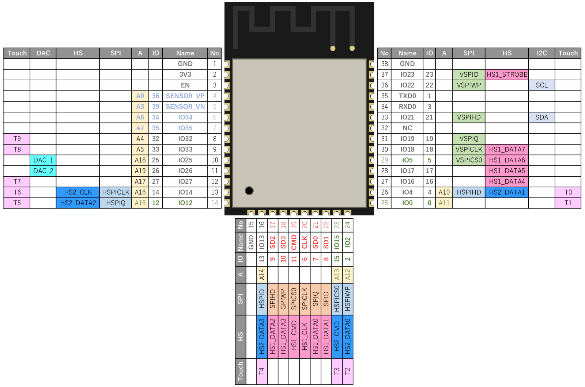

# ESP32 Reference

## Pin-out
On-shield `ESP32-WROOM-32` connection with `OrangePi Zero Plus(2)` listed as follows.

### Connection
| ESP32 | OPi0+ | OPi0+2 |
| -     | -     | -      |
| EN    | PA19  | PA19   |
| BOOT  | PA18  | PA18   |
| DRDY  | PA07  | PD11   |
| UART0 | UART1 | UART2  |
| UART1 | UART2 | ------ |
| HSPI  | SPI1  | SPI1   |

### OPi0+ Pin Number
| num  | UART1     | UART2     | SPI1                 |
| -    | -         | -         | -                    |
| GPIO | T198 R199 | T0   R1   | CS13 CLK14 MO15 MI16 |
| PIN  | PG06 PG07 | PA00 PA01 | PA13 PA14  PA15 PA16 |


### OPi0+2 Pin Number
| num  | UART2     | SPI1                 |
| -    | -         | -                    |
| GPIO | T0   R1   | CS13 CLK14 MO15 MI16 |
| PIN  | PA00 PA01 | PA13 PA14  PA15 PA16 |


### ESP32 Pin Number
| num  | EN | BOOT | DRDY | UART0 | UART1  | HSPI                 |
| -    | -  | -    | -    | -     | -      | -                    |
| GPIO | -- | 0    | 4    | T1 R3 | T10 R9 | CS15 CLK14 MI12 MO13 |
| PIN  | 3  | 25   | 26   | 35 34 | 18  17 | CS23 CLK13 MI14 MO16 |




## Usage
### Firmware
- Pre-compiled binary firmware files are in folder `firmware`.
    - boot_app0.bin
    - bootloader.bin
    - default.bin
    - ESP32_Sandbox.ino.bin

- Or you can compile with `ESP-IDF` and `arduino-esp32`.
    1. Setup [`ESP-IDF`](https://github.com/espressif/esp-idf) as described in its page.
    ```bash
    # example of setup ESP-IDF (on Debian)
    # 1.1 install compiler(toolchain)
    sudo apt-get install gcc git wget make libncurses-dev flex bison gperf python python-serial
    wget https://dl.espressif.com/dl/xtensa-esp32-elf-linux64-1.22.0-80-g6c4433a-5.2.0.tar.gz -O xtensa-esp32.tar.gz
    tar -xvzf xtensa-esp32.tar.gz
    # 1.2 set toolchains path in environment
    echo PATH="\$PATH:$(pwd)/xtensa-esp32-elf/bin" ~/.profile
    # 1.3 get and config ESP-IDF(headers and libs)
    git clone --recursive https://github.com/espressif/esp-idf.git
    cd esp-idf && git submodule update --init --recursive
    echo IDF_PATH=$(pwd) >> ~/.profile
    ```

    2. Setup [`arduino-esp32`](https://github.com/espressif/arduino-esp32) as one of `ESP-IDF` components.
    ```bash
    # example of setup arduino-esp32
    # 2.1 setup arduino-esp32
    cd ${IDF_PATH}/examples && mkdir arduino-core && cd arduino-core
    mkdir -p components && cd components && \
    git clone https://github.com/espressif/arduino-esp32.git arduino && \
    cd arduino && git submodule update --init --recursive && cd ../..
    # 2.2 create a new project folder
    MyProjectName=esp32-embci
    mkdir -p ${MyProjectName}/main && cd ${MyProjectName}
    sed 's/blink/${MyProjectName}.ino/g' "../../get-started/blink/Makefile" > Makefile
    ln -s ../components components
    echo "#include <Arduino.h>" > main/main.cpp
    ```

    3. Then compile with command `make menuconfig && make all`.
    ```bash
    # example of compile from source
    # 3.1 add access to source file
    rm -rf main
    ln -s ${EMBCI_PATH}/files/esp32/src ./main
    # 3.2 remember to tick on "Autostart Arduino setup and loop on boot"
    make menuconfig && make all
    # 3.3 copy generated binary files into folder `firmware`
    ln -s ${EMBCI_PATH}/files/esp32/firmware ./firmware
    cd build
    cp ota_data_initial.bin ../firmware/boot_app0.bin
    cp bootloader/bootloader.bin ESP32_Sandbox.ino.bin default.bin ../firmware/
    ```

### Flash
Run `burning.sh` script to flash firmware binary files into on-shield ESP32. Use `sudo` if needed.


### Monitor
```bash
miniterm.py /dev/ttyS1 115200
# or
screen /dev/ttyS1 115200
```
or any other serial monitor.

### Serial Interface (Deprecated in v0.1.4)
Example output of serial.
```
ESP32 Firmware XXXX.XX-EmBCI
Board:  OrangePi Zero Plus [2]
Shield: EmBCI Rev.XX XXX XX XXXX
Booting...
...
Press `h` for help message
...
Supported commands:
    h - print this Help message
    c - Clear spi fifo queue
    d - change esp output Data source
    m - be less verbose (Mute)
    s - print Summary of current status
    v - be more Verbose
    w - turn on/off serial-to-Wifi redirection
```

### UART Console-like Interface (Added in v0.1.5)
Example output of serial.
```
--- Miniterm on /dev/ttyUSB0  115200,8,N,1 ---
--- Quit: Ctrl+] | Menu: Ctrl+T | Help: Ctrl+T followed by Ctrl+H ---
rst:0x1 (POWERON_RESET),boot:0x13 (SPI_FAST_FLASH_BOOT)
...
E (30) EmBCI: IDF Version: v3.2-dev-1385-g129d327
E (30) EmBCI: Chip info:
E (30) EmBCI: 	model: ESP32
E (30) EmBCI: 	cores: 2
E (40) EmBCI: 	feature: /802.11bgn/BLE/BT/External-Flash: 4 MB
E (40) EmBCI: 	revision number: 1
E (50) EmBCI: Firmware Version: 2019.4-EmBCI
E (50) EmBCI: ARM Board: OrangePi Zero Plus 2
E (50) EmBCI: EmBCI Shield: EmBCI Rev.B1 Apr 12 2019
I (1220) EmBCI: Type `help` for commands message
EmBCI> help
help
  Print the list of registered commands

sample_rate  [-r <0-6|250|500|1k|2k|4k|8k|16k>]
  Print or set ADS1299 sample rate
  -r, --rate=<0-6|250|500|1k|2k|4k|8k|16k>  specify sample rate (250-16000) or its index (0-6)

input_source  [-s <0-5|Normal|BIAS|Shorted|MVDD|Temperature|Test>] [-c <0-7>]
  Print or set ADS1299 data source
  -s, --source=<0-5|Normal|BIAS|Shorted|MVDD|Temperature|Test>  specify source name or its index (0-5)
  -c, --channel=<0-7>  specify channel number, default all

bias  [<on|off>] [-c <0-7>]
  Print or set ADS1299 BIAS output state
      <on|off>  action can also be <true|false>
  -c, --channel=<0-7>  specify channel number, default all

impedance  [<on|off>] [-c <0-7>]
  Print or set ADS1299 impedance measurement
      <on|off>  action can also be <true|false>
  -c, --channel=<0-7>  specify channel number, default all

clear
  Clear SPI FIFO queue

reset
  Reset ads1299 and read id register

output  [-d <0|1|2|3>]
  Display or change esp output data source
  -d, --data=<0|1|2|3>  specify data source

connect
  not implemented yet

disconnect
  not implemented yet

echo  [<on|off>] [-c <0-7>]
  Turn on/off serial-to-Wifi direction
      <on|off>  action can also be <true|false>
  -c, --channel=<0-7>  specify channel number, default all

sleep  [-t <t>] [-p <n>]... [-l <0|1>]... [--method=<light/deep>]
  Turn ESP32 into light/deep sleep mode
  -t, --time=<t>  wakeup time, ms
  -p, --gpio=<n>  If specified, wakeup using GPIO with given number
  -l, --level=<0|1>  GPIO level to trigger wakeup
  --method=<light/deep>  sleep method

restart
  Software reset of ESP32

shutdown
  Cut off power supply of whole EmBCI Board

verbose
  Increase verbosity

quiet
  Decrease verbosity

summary
  Print summary of current status

version
  Get version of chip and SDK

tasks
  Get information about running RTOS tasks
```
